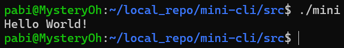
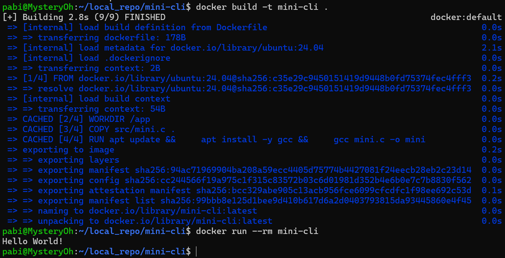
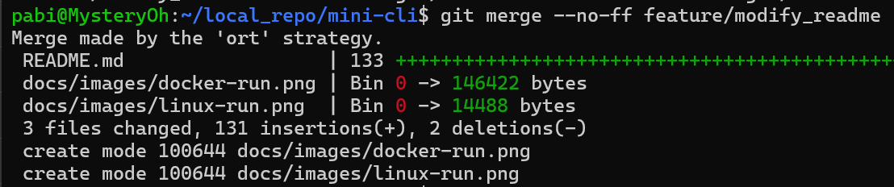

# 🛠️ Mini CLI Tool Project

> 간단한 CLI 프로그램을 제작하고, Linux 실행 및 Docker 패키징, GitHub 버전관리 실습을 수행한 프로젝트입니다.

---

## 📁 프로젝트 구조

```
mini-cli/
 ├─ src/
 │   └─ mini.c 또는 mini.sh
 ├─ Dockerfile
 ├─ README.md
 ├─ LICENSE
 └─ docs/
     └─ images/
```

---

## 🚀 1. Mini 프로그램


### ✔ 코드

```c
#include <stdio.h>

int main(void) {

    printf("Hello World!\n");

    return 0;
}

```

---

## 🧪 2. Linux 실행 결과

### ✔ 실행 명령어
```bash
# 프로그램 소스 코드
gcc src/mini.c -o mini
./mini
```

### 실행 화면 캡처  


---

## 3. Dockerfile 및 실행 결과

### ✔ Dockerfile
```Dockerfile
FROM ubuntu:24.04

WORKDIR /app

COPY src/mini.c .

RUN apt update && \
    apt install -y gcc && \
    gcc mini.c -o mini

CMD ["./mini"]
```

### ✔ Docker 이미지 빌드
```bash
docker build -t mini-cli .
```

### ✔ Docker 실행
```bash
docker run --rm mini-cli
```

### ✔ 실행 화면 캡처  


---

## 4. GitHub 버전관리 내역

### 체크리스트
- [✔] Commit 5회 이상  
- [✔] Branch 생성  
- [✔] Branch → main Merge  
- [✔] 의미 있는 Commit 메시지  

### 설명
```
Add LICENSE file with MIT license - LICENSE 파일을 MIT License를 적용해 생성했음을 알림.
Add mini C program source code - C 프로그램을 추가했다는 것을 알림.
Add Dockerfile for Release - 배포용 Dockerfile을 생성했다는 것을 알림.
Modified README.md file - README 파일을 수정했다는 것을 알림.
Add result screenshot images - 실행 결과 이미지 파일을 추가했다는 것을 알림.
feature/modify_readme 브랜치를 생성해 README.md 파일을 수정하고 이미지를 첨부한 뒤 main으로 merge함.
```

### 캡처


---

## 5. LICENSE 파일  

```
본 프로젝트는 MIT License를 적용합니다.
```

---

## 6. 고찰

- 배운 점: Docker를 이용한 컨테이너화를 직접 사용해보며 Docker의 작동 방식에 대해서 알게 됨.
- 어려웠던 점: git push에 계속 실패해서 확인해보니 wsl 환경에서 작업을 하다보면 가끔씩 네트워크 연결이 끊겨 wsl 재실행이 필요했었음.
- 흥미로웠던 부분: Docker 이미지로 실행 환경을 패키징해서 실행하는 것이 흥미로웠습니다.
- 개선하고 싶은 점: 코드를 업데이트하면 자동으로 Docker 이미지를 업데이트하는 파이프라인을 구축하고 싶습니다.

---

## 7. 참고 자료

- https://docs.docker.com/  
- https://gcc.gnu.org/   

